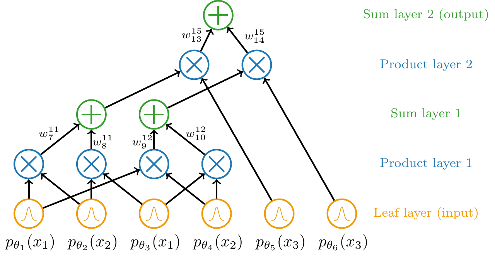

## Hybrid Continuous Mixtures of Probabilistic Circuits

This repo contains all programs used to train and test hybrid continuous mixtures of probabilistic circuits for my master's thesis. I suggest running with a powerful GPU, e.g. at least a 32 GB V100 GPU. I'm unsure if they can be ran on commercial GPUs, especially those with VRAM <32 GB.


### Dependencies and Python version
tomorrow's dewi will fill this in

Repo structure:
- ```/data```: the data used for training and testing
- ```/figures```: figures pertaining to classification accuracies and drawn samples
- ```/logs```: parameters of trained models. Also contains meta data about the models, e.g. the number of components trained with, latent dimension, lambda value when relevant. The number of epochs reached can be found in ```checkpoints```
- ```/programs```: core programs needed to learn decoders and apply latent optimisation
- ```/utils```: utility-like programs, e.g. fixed seeding for reproducible results
- ```hybrid_cmpc_test``` and ```hybrid_cmpc_train```. The reason for writing the test programs as notebooks is for ease of use for anyone curious.

