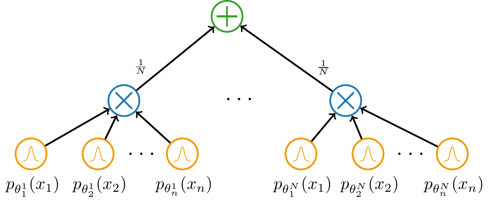
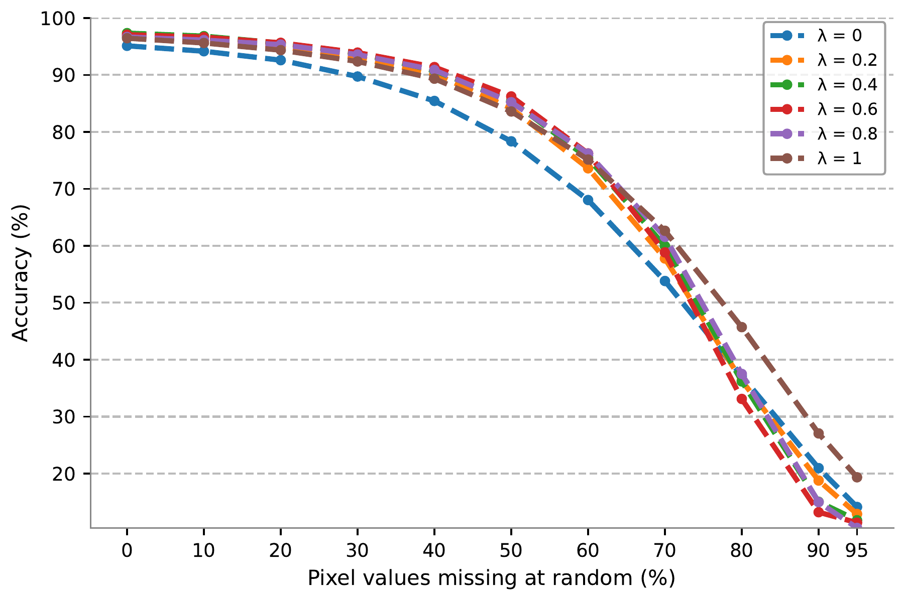
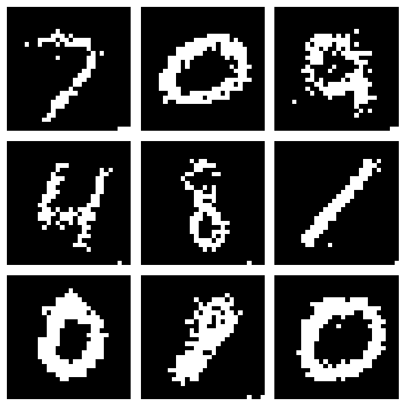

## Hybrid Continuous Mixtures of Probabilistic Circuits (hybrid CMPCs)

This repo contains all programs used to train and test hybrid continuous mixtures of probabilistic circuits for my master's thesis. I using a powerful GPU to run `hybrid_CMPC_train.py` and `hybrid_CMPC_test.ipynb`, e.g. a 32 GB V100 GPU.

### Dependencies (Python 3.10.4)

Install all dependencies by opening a terminal, setting its directory to the root of this repository and running `pip install -r requirements.txt`.

### Repo structure
- `/data`: Data used for training and testing.
- `/figures`: Figures pertaining to classification accuracies and drawn samples.
- `/logs`: Trained models: their parameters and architecture.
- `/models`: Implementations of the forward passes of our decoders and continuous mixtures. Also contains the decoder architectures and implementations of latent optimisation.
- `/utils```: Utility-like programs: fixed seeding program for reproducible results, binary-entropy and cross-entropy loss functions.
- `hybrid_CMPC_train.py` and `hybrid_CMPC_test.ipynb`: Implementations of training and testing hybrid CMPCs. 

**Bencmarking:** To benchmark hybrid CMPCs trained and stored in `/logs` simply run the blocks in `hybrid_CMPC_test.ipynb`. It's in the form of a Python notebook to make it a friendly experience.

❗Some of the benchmarking blocks in the notebook require a long time to run. I've stated the times taken for me to run some of them on a 40 GB A100 GPU as a point of reference.

### Brief description of hybrid CMPCs
Probabilistic circuits (PCs) are a class of deep generative probabilistic models which offer efficient means of answering common probabilistic queries such as marginals. Their applications include sampling, anomaly detection, classification and density estimation, to name a few.


Continuous mixtures of PCs (CMPCs) are appropriately-weighted ensembles of PCs
$$
p(\mathbf{x})=\frac{1}{N}\sum_{i=1}^Np_{\phi}(\mathbf{x}|\mathbf{z}_i)
$$
where the parameters of each component PC are determined by a decoder $\phi$ given some latent sample $\mathbf{z}\in\Omega_{\mathbf{Z}}$. At the time of their publication, CMPCs were learned entirely generatively and obtaining state-of-the-art results among PC-based methods for generative tasks.



Hybrid CMPCs are CMPCs learned using a hybrid learning objective which encourages both generative and discriminative learning. This is done by minimising
$$
\mathcal{L}_{\lambda}(\phi)=\lambda\text{CE}(\phi)+(1-\lambda)\text{NLL}(\phi)
$$
where $\text{CE}(\phi)$ is a measure of the model's discriminatory ability and $\text{NLL}(\phi)$ is a measure of the model's generative ability.

**Classification accuracies obtained by a hybrid CMPC trained on Binary MNIST**

We see that hybrid CMPCs can classify incomplete samples effectively

**Samples drawn from a hybrid CMPC trained on Binary MNIST**

